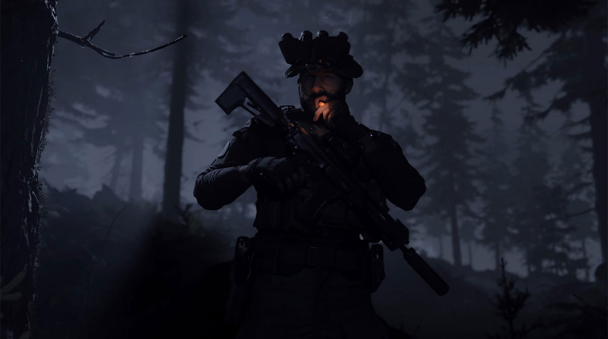
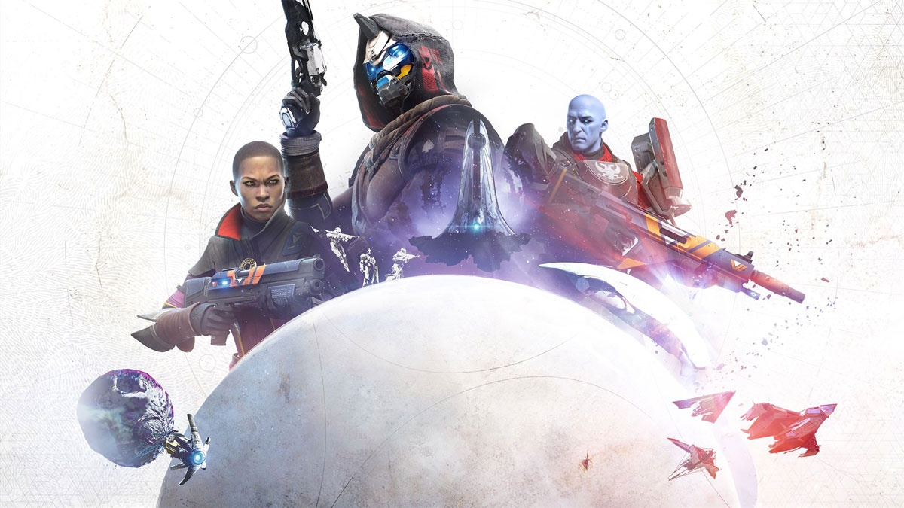

# 2019

## Luigi's Mansion 3

<colorBadge text="Recommended" type="recommended"/>
<colorBadge text="Nintendo Switch" type="switch"/>

## Pokémon Sword

<colorBadge text="Indifferent" type="indifferent"/>
<colorBadge text="Nintendo Switch" type="switch"/>

## Super Mario Odyssey

<colorBadge text="Recommended" type="recommended"/>
<colorBadge text="Nintendo Switch" type="switch"/>

## Call of Duty: Modern Warfare

<colorBadge text="Recommended" type="recommended"/>
<colorBadge text="Playstation 4" type="ps4"/>

## Borderlands 3

<colorBadge text="Recommended" type="recommended"/>
<colorBadge text="Playstation 4" type="ps4"/>

## South Park: The Fractured but Whole

<colorBadge text="Recommended" type="recommended"/>
<colorBadge text="Playstation 4" type="ps4"/>

## South Park: The Stick of Truth

<colorBadge text="Recommended" type="recommended"/>
<colorBadge text="Playstation 4" type="ps4"/>

## Torchlight 2

<colorBadge text="Recommended" type="recommended"/>
<colorBadge text="Playstation 4" type="ps4"/>

## Call of Duty: Black Ops 4

<colorBadge text="Recommended" type="recommended"/>
<colorBadge text="Playstation 4" type="ps4"/>

## Injustice 2

<colorBadge text="Recommended" type="recommended"/>
<colorBadge text="Playstation 4" type="ps4"/>

## The Elder Scrolls Online

<colorBadge text="Recommended" type="recommended"/>
<colorBadge text="Playstation 4" type="ps4"/>

## MineCraft

<colorBadge text="Indifferent" type="indifferent"/>
<colorBadge text="Playstation 4" type="ps4"/>

## Destiny 2

<colorBadge text="Recommended" type="recommended"/>
<colorBadge text="Playstation 4" type="ps4"/>

## Overcooked

<colorBadge text="Recommended" type="recommended"/>
<colorBadge text="Playstation 4" type="ps4"/>

## The Surge

<colorBadge text="Recommended" type="recommended"/>
<colorBadge text="Playstation 4" type="ps4"/>

## Cities: Skylines

<colorBadge text="Recommended" type="recommended"/>
<colorBadge text="Playstation 4" type="ps4"/>

## Path of Exile

<colorBadge text="Indifferent" type="indifferent"/>
<colorBadge text="Playstation 4" type="ps4"/>

## Sekiro: Shadows Die Twice

<colorBadge text="Recommended" type="recommended"/>
<colorBadge text="Playstation 4" type="ps4"/>

## Apex Legends

<colorBadge text="Indifferent" type="indifferent"/>
<colorBadge text="Playstation 4" type="ps4"/>

## Steep

<colorBadge text="Indifferent" type="indifferent"/>
<colorBadge text="Playstation 4" type="ps4"/>

## Dark Souls III

<colorBadge text="Recommended" type="recommended"/>
<colorBadge text="Playstation 4" type="ps4"/>

